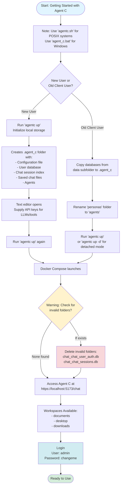

# Agent C - The Centric AI accelerator

From the days of GPT-3 the Agent C framework has been powering LLM based solutions at Centric Consulting.  It predates most agent framework/SDKs except for LangChain and from the very beginning we took a different route.  Instead of building solutions for the models we wished we had, we built solutions that could be made reliable with the models we do have.  While many other frameworks enforce rigid patterns, our "instruction first" philosophy has allowed us to be nimble and flexible.

> [!NOTE]
> **Instruction First** means starting with what you can accomplish through clear instructions to capable models, then designing tools specifically to support and enhance that instruction-following. It's not that tools are unimportant, they're absolutely critical for providing capabilities that models don't have. But the design philosophy is fundamentally different from traditional software development. 
>
> **Everything you learn about building agents in Agent C transfers to any other framework or platform.** Why? Because you're fundamentally learning how to communicate effectively with language models, not how to use a specific tool. The sophisticated coordination patterns, quality frameworks, delegation strategies, and recovery protocols, all of these are expressed in natural language instructions that work with any sufficiently capable model. 
> 

## The Agent C "special sauce"

What sets Agent C apart from other frameworks / solutions isn't any one thing, or some checklist of features in a comparison grid, it's a combination of many small things, few of them revolutionary that add up to a greater whole.  By focusing on getting the most out of the models we have, Agent C has been able to rapidly advance along with the models while others lag behind. 

### Interleaved thinking 
"Interleaved thinking" is one of the recent advances, that had an immediate impact and has since become a cornerstone of what makes an agent an "Agent C agent". Introduced in March by Anthropic allows a model to perform reasoning while making tool calls instead of just at the start of the interaction.  This allows the model to adapt to new information instead of blindly following a course of action. 

Agent instructions in Agent C steer the agent to use this capability more effectively, ensuring that not only is reasoning performed regularly, but that the agent is "thinking" about the correct things.


### Efficient, integrated tools 
The tool system in Agent C was designed to make developing tools for agents "dirt simple" while still providing advanced features foud in few other frameworks. While thins like MCP a great for prototyping it falls short in manu areas where Agent C excels: performance, integration and dynamic content.

- **Performance**: Agent C tools can be in-process with the agent runtime and avoid a lot of network overhead.
  - Agent C tools strive to be as efficient as possible.  There are many "micro optimizations" scattered throughout our tools that were created by observing real world usages of the tools by agents, and then finding ways to reduce the token burden  
- **Integration**: Agent C tools can depend on and make use of other tools.  For example: The MCP "file system" tool allows an *agent* access to a file system. The Agent C `Workspace` tool does the same thing, but with a couple key differences: 1. Our workspaces can be local, S3, or Azure blob storage and 2. Any other tool that needs to use the file system does so through this tool allowing tools to share data witout an agent in the middle
  - Tools have access to a rich set of context information about the user / chat session and importantly, **tools can communicate information directly to the user, bypassing the agent**
- **Dynamic Content**: Any Agent C tool can provide it's own "prompt section" that can contain anything from enhanced instruction, to rendering dynamic content. Prompt sections are templates that are rendered and stitched together to form the system prompt for the agents.  They're rebuilt just before each call to the vendor API.
  - Dynamic content rendered in the system prompt can be ephemeral, lasting only as long as the agent needs it, then discarded.  Content return as a tool call result lives in the context until "context management" comes in like a wrecking ball and removes the oldest calls. Rendering to the prompt gives tool developers greater control over when their content gets "house cleaned"
    
### Planning, following and reporting

The default interaction patterns in Agent C are modeled after many of the patterns we use as humans in order to manage complex work. Agent C agents work more like a team of professions working with a shared network drive and Kanban board than anything resembling software.  Agent C agents have protocols for planning that are designed for reliability and resiliency. Originally designed to support multi-session work without introducing errors, our planning tools and instructions guide the agents to break work down in manageable pieces, provide clear instructions and context for each step, "definition of done", etc.  Taking into account not only context window limitations, but the cognitive load on the human "driver" who must verify their output.

As agents follow a plan the user is kept informed not only by the agent but by the tools as well. As plans are built and updated, the UI reports it.  When an agent completes a task, the UI shows the completion report it filed for the task.  With our enhanced Markdown support agents can and will include Mermaid digrams, SVGs etc in their reports.

- Rich context management: technical, business, implementation, and risk context
- Hierarchical task organization with parent-child relationships
- Human oversight integration with required sign-offs and audit trails
- Knowledge capture and automated report generation (without consuming agent context!)

### Delegation

The delegation tools in Agent C are where single-agent limitations transform into multi-agent possibilities and allow for large volumes of work to be reliably preformed without suffering from and overloaded context window.

**Three Delegation Patterns**:

- **Agent Clone Tools**: Perfect self-delegation for routine tasks. Your agent can create exact copies of itself to handle focused work while preserving its context for strategic thinking and user interaction. Each clone gets specific process context that transforms generic capability into specialized execution.
  
- **Agent Assist Tools**: Collaboration with specialized agents from a broader ecosystem. Need expert analysis, creative writing, or domain-specific capabilities? Agents can consult specialists without you managing the coordination.
  
- **Agent Team Tools**: Structured collaboration with predefined teams of specialists. For complex projects, orchestrator agents coordinate teams of focused experts, each handling specific aspects while maintaining clear handoff procedures and quality gates.

Traditional single-agent approaches hit a wall: either your agent tries to do everything and burns through its context window, or you manually manage multiple agents and their coordination. Agent C's delegation tools enable sophisticated multi-agent workflows through natural language instructions rather than code.

The sophistication here might seem overwhelming—delegation rules, handoff procedures, recovery protocols, quality gates—but here's the thing: **you don't design these coordination patterns alone**.

### Meet Bobb: Your Expert Agent Designer

Agent C is instruction-first. If you can express something in a system prompt, an agent can create that system prompt. **Bobb the Agent Builder** is a specialized agent who designs other agents—from simple task executors to sophisticated orchestration systems with comprehensive coordination patterns, quality frameworks, and recovery mechanisms.

When you need a coding assistant for a new project, Bobb:

- Analyzes your project structure to understand technical requirements
- Identifies appropriate tools and guides you to equip them
- Extracts domain guidelines from your documentation
- Composes instruction patterns from proven quality frameworks
- Designs coordination protocols if multi-agent workflows are needed
- Implements appropriate safeguards based on complexity

Bobb has access to our comprehensive agent delegation design bible—all those complex coordination patterns, context management strategies, and quality assurance frameworks. You explain what you want to accomplish; Bobb handles the intricate technical details.


> [!IMPORTANT]
>  **Agent C Agents are something you've never worked with before.** The hardest thing for most people to do is to change their mindset from "thinking about software" to *thinking about interns*.  "Driving" agents is a skill it takes time to develop.

## Agent C "Quick" Install (Preview) 

The compose files here allow Docker/Rancher users to get up in running using a local version of Agent C without needing to install a bunch of developer tools on their machines.  It also provides Agent C developers to run the Agent C Client while working on the Agent C client.

> [!WARNING]
> While the new reference client offers a far better user experience han Agent C has ever had but...
> 
> It is still under heavy development and is short several features, but it's quite usable, if a little rough around the edges.
> 

## Getting started

The `agentc` shell script or `agent_c.bat` script allows you to run the Agent C API and web client behind an HTTPS proxy using self-signed certs.  

Once started you will be able to access Agent C at https://localhost:5173/chat *If you forget the port and have nothing listening on 443 you will be redirected.*

Getting started is a two step process:


### New users
1. **Initialize your local storage** - Run `agentc up`. 
   - This will create a `.agent_c` folder under your home folder where it will store:
     - The configuration file
     - The user database
     - The chat session index.
     - Your saved chat files
     - Any agents you create
   - It will then open a text editor so that you can supply the various API keys for the LLMs / tools you want to use. 
2. **Run Agent C** - Run `agentc up` again and it will see that you have a config file and launch the compose file.

### Users of the old client
1. **Copy the databases** - Copy the two databases in the `data` subfolder to yout `.agent_c` subfolder of your user folder.
2. **Rname your personas folder** - Rename this it `agents` and your old agents will be there. 
3. **Run Agent C** - Run `agentc up` it will see that you have a config file and launch the compose file. 
   - Alternately run `agentc up -d` or `agent_c.bat up -d` to run in detached mode.

**NOTE:** Some users when running `agent_c.bat` may notice it creates a folder called `chat_chat_user_auth.db` or `chat_chat_sessions.db` These are invalid folders and must be deleted. 

### All users

The purpose of using these scripts over a simple `docker-compose up` (Which works for the client only compose file) is to map several well known folders to workspaces in Agent C. Docker users will have the following workspaces available for agents to access the local file system and run commands:

- documents
- desktop
- downloads

An easy was to add additional ones without building your own container is on the list.


## Logging in

There is one user, `admin` with the password `changeme`,  Except as of this writing tha ability to actually change it if you're a user doesn't exist.. Hence preview status.




### 💻 Developer Setup

#### Prerequisites

**EXPAND THE ONE FOR YOUR OS AND READ**
Notice: ALL platforms MUST use Python 3.12.x NOT 3.13 not 3.10

If you are NOT a Python developer who is used to working with Python virtual environments you are STRONGLY urged to use PyCharm as an IDE until you've gotten more comfortable with Python. Almost every single developer that has had issues getting started was using VSCode. The only exceptions have been those using PyCharm, but having the wrong version of Python. 

<details>
<summary><b>Windows Prerequisites</b> (click to expand)</summary>

- [Git](https://git-scm.com/downloads/win)
- [Python 3.12+](https://www.python.org/downloads/release/python-3129/)
- A Python IDE like [PyCharm](https://www.jetbrains.com/pycharm/download/) (Community Edition is free)
- [Microsoft Visual C++ Build Tools](https://visualstudio.microsoft.com/downloads/) (Be sure to check the "C++ development" option)
  - Or run: `winget install Microsoft.VisualStudio.2022.BuildTools`
- [Rust](https://www.rust-lang.org/tools/install)
- [Node.js](https://nodejs.org/en/download)
- [ffmpeg](https://ffmpeg.org/download.html#build-windows)
- Optional: [pyenv](https://github.com/pyenv-win/pyenv-win) (for managing Python versions)

</details>

<details>
<summary><b>Mac/Linux Prerequisites</b> (click to expand)</summary>

1. Install Xcode command line tools:
   ```bash
   xcode-select --install
   ```

2. Install Homebrew (if not already installed):
   ```bash
   /bin/bash -c "$(curl -fsSL https://raw.githubusercontent.com/Homebrew/install/HEAD/install.sh)"
   ```

3. Install required packages:
   ```bash
   brew install python@3.12 pyenv rust node ffmpeg
   ```

4. Optional: Install development tools:
   ```bash
   brew install visual-studio-code
   brew install --cask pycharm-ce
   ```
</details>

#### Step 1: Clone the Repository

```bash
git clone https://github.com/centricconsulting/agent_c_framework.git
cd agent_c_framework
```

#### Step 2: Set Up Your Python Environment

Python projects typically use "virtual environments" to keep dependencies isolated. This prevents conflicts between different projects on your system.

**Use the Setup Scripts (Recommended)**

Run the setup script for your platform - these scripts are kept up-to-date with the latest requirements:

```bash
# On Windows
.\scripts\initial_setup.bat

# On Mac/Linux
./scripts/initial_setup.sh
```

If you need to understand what dependencies are being installed, please review these setup scripts to see the exact packages and versions being used.

#### Step 3: Get a vendor API Key

Agent C requires at least one API key from a major vendor to function.

**NOTE: If you must choose only one, choose Anthropic.  Right now, NOTHING comes close to Claude for Agentic work.**

**Anthropic**
Follow the [Get Started With Claude](https://docs.anthropic.com/en/docs/get-started) guide 

> **Important**: Until you have reached "[Tier 3](https://docs.anthropic.com/en/api/rate-limits#requirements-to-advance-tier)" with Anthropic you will receive warnings in the chat stream about hitting your rate limit. The runtime will "back off" and slow down for an increasing amount of time until enough time has passed to allow number of tokens you have through.  Expect delays of up to 32 seconds when on Tier 2 or below.

**Open AI**
1. Sign up at the [OpenAI Platform](https://platform.openai.com/signup)
2. Navigate to [API Keys](https://platform.openai.com/settings/organization/api-keys)
3. Create a new API key
4. Prepay/deposit an amount (e.g., $20 USD) for usage credits

> **Important**: A ChatGPT Plus subscription is **not** sufficient - you need an actual API key.

#### Step 4: Configure Environment Variables

1. Copy the example environment file to create your own:
   ```bash
   cp example.env .env
   ```

2. Edit `.env` to add your OpenAI API key:
   ```
   OPENAI_API_KEY=your-api-key-here
   ```



```mermaid
flowchart TD
    Start([Developer Setup]) --> PyVersion[CRITICAL: Must use Python 3.12.x<br/>NOT 3.13, NOT 3.10]
    
    PyVersion --> IDENote[Recommended IDE: PyCharm<br/>Especially if new to Python virtual environments]
    
    IDENote --> OS{Select Your OS}
    
    OS -->|Windows| WinPrereq[Install Prerequisites:<br/>- Git<br/>- Python 3.12+<br/>- PyCharm Community Edition<br/>- MS Visual C++ Build Tools<br/>- Rust<br/>- Node.js<br/>- ffmpeg<br/>- Optional: pyenv]
    
    OS -->|Mac/Linux| MacPrereq[Install Prerequisites:<br/>1. Xcode command line tools<br/>2. Homebrew<br/>3. python@3.12, pyenv, rust, node, ffmpeg<br/>4. Optional: VSCode, PyCharm]
    
    WinPrereq --> Clone[Step 1: Clone Repository<br/>git clone https://github.com/centricconsulting/agent_c_framework.git]
    MacPrereq --> Clone
    
    Clone --> Setup{Step 2: Setup Python Environment}
    
    Setup -->|Windows| WinSetup[Run: .\scripts\initial_setup.bat]
    Setup -->|Mac/Linux| MacSetup[Run: ./scripts/initial_setup.sh]
    
    WinSetup --> APIKey[Step 3: Get Vendor API Key]
    MacSetup --> APIKey
    
    APIKey --> Vendor{Choose Primary Vendor<br/>Recommendation: Anthropic for Agentic work}
    
    Vendor -->|Anthropic| Anthropic[Get Anthropic API Key<br/>Follow 'Get Started With Claude' guide<br/><br/>WARNING: Tier 2 or below will have<br/>rate limit delays up to 32 seconds]
    
    Vendor -->|OpenAI| OpenAI[Get OpenAI API Key<br/>1. Sign up at OpenAI Platform<br/>2. Create API key<br/>3. Prepay credits minimum $20<br/><br/>NOTE: ChatGPT Plus NOT sufficient]
    
    Anthropic --> EnvSetup[Step 4: Configure Environment<br/>1. Copy example.env to .env<br/>2. Add API keys]
    OpenAI --> EnvSetup
    
    EnvSetup --> ConfigFile[First Run Creates Config File:<br/>Windows: %USERPROFILE%\.agent_c\agent_c.config<br/>Mac/Linux: ~/.agent_c/agent_c.config]
    
    ConfigFile --> Essential[Essential Configuration:<br/>ANTHROPIC_API_KEY=your-key]
    
    Essential --> Optional[Optional Configuration:<br/>- OPENAI_API_KEY<br/>- Azure OpenAI settings<br/>- AWS Storage<br/>- Tool APIs: SERPAPI, SEC_API,<br/>  TAVILI, NEWSAPI]
    
    Optional --> RunMode{Choose Run Mode}
    
    RunMode -->|Docker| Docker[Use agentc.sh POSIX or agent_c.bat Windows<br/>See Getting Started diagram]
    
    RunMode -->|Native Professional| Native{Select Platform <br/> and run from<br/>project root}
    
    Native -->|Windows| WinNative[start scripts\start_api.bat<br/>start scripts\start_client.bat]
    
    Native -->|Mac/Linux| MacNative[scripts/start_api.sh &<br/>scripts/start_client.sh &]
    
    Docker --> End([Setup Complete])
    WinNative --> End
    MacNative --> End
    
    style Start fill:#e1f5ff
    style PyVersion fill:#f8d7da
    style IDENote fill:#fff3cd
    style Vendor fill:#d1ecf1
    style Anthropic fill:#d4edda
    style Essential fill:#d4edda
    style End fill:#d4edda
```

### Special Note for Debugging the API in Pycharm
Debugging in PyCharm is challenging due to the self-signed certs.  However, there is a way to run the backend via PyCharm in debug mode.  Fair warning, it is a bit slow.  Here are the configuration settings you need.
1. Open PyCharm and go to "Run" > "Edit Configurations".
2. Click the "+" icon to add a new configuration and select "Python".
3. Name the configuration (e.g., "Backend").
4. Application File Path: Set this to the path of `main.py`, example`C:\%USER%\PyCharmProjects\agent_c_framework\src\agent_c_api\src\agent_c_api\main.py` folder.
5. Working Directory: Set this to the `agent_c_framework` folder.
6. Uvicorn Options: `--ssl-keyfile .\agent_c_config\certs\key.pem --ssl-certfile .\agent_c_config\certs\cert.pem`


## Configuration File

When you first run Agent C, it will create a configuration file (similar to `.env`) that needs to be modified before Agent C will function properly. This file contains API keys and other settings.

```
# Location of configuration file:
# Windows: %USERPROFILE%\.agent_c\agent_c.config
# Mac/Linux: ~/.agent_c/agent_c.config
```


### Professional: Native

For development or to allow for mapping of ANY folder as a workspace (Docker makes that hard to do on the fly) you may run the API and React frontend directly on your machine with:

**Windows**
```commandline
start scripts\start_api.bat
start scripts\start_client.bat
```

**OSX/Liunx
```bash
scripts/start_api.sh &
scripts/start_client.sh &
```

### Essential Configuration

These settings are required for basic functionality:

```bash
ANTHROPIC_API_KEY=your-anthropic-key-here
```

### Optional Configuration

The following sections allow additional functionality if you have these services:

```bash
# Optional Vendor Keys 
OPENAI_API_KEY=your-openai-api-key-here

# Optional: Azure OpenAI (uncomment if using Azure instead of OpenAI)
AZURE_OPENAI_API_KEY=your-azure-key-here
AZURE_OPENAI_ENDPOINT=https://your-resource.openai.azure.com/
AZURE_OPENAI_API_VERSION=2024-03-01-preview

# Optional: AWS Storage
AWS_REGION_NAME=your-region-name
AWS_SECRET_ACCESS_KEY=your-secret-access-key
AWS_ACCESS_KEY_ID=your-access-key-id


# Optional: API keys for various tools
# Uncomment and add keys for tools you want to use
SERPAPI_API_KEY=your-serpapi-key-here        # For web searches
SEC_API_KEY=your-sec-api-key-here            # For SEC filings access
TAVILI_API_KEY=your-tavili-key-here          # For Tavili integration
NEWSAPI_API_KEY=your-newsapi-key-here        # For news access
```


## Working with Files

Agent C creates a `LocalStorageWorkspace` called `project` that gives the agent access to files in the project root. Use the `temp` folder for files you want the agent to work with.

To reference files, use: "Could you load temp/data.csv from the project workspace and..."


## Additional Documentation

- Each submodule has its own README
- `docs/tools.md`: Information on creating new tools and using existing ones
- `docs/prompts.md`: Details on the prompt builder
- `docs/web_tool.md`: Explains the Web tool and content formatters

## License

This project is licensed under the Business Source License 1.1.
- **Licensor**: Centric Consulting
- **Licensed Work**: Agent C Framework
- **Change Date**: 2024-12-31
- **Additional Use Grant**: None

For details, see the [LICENSE](./LICENSE) file or visit the [BSL 1.1 website](https://mariadb.com/bsl11/).
